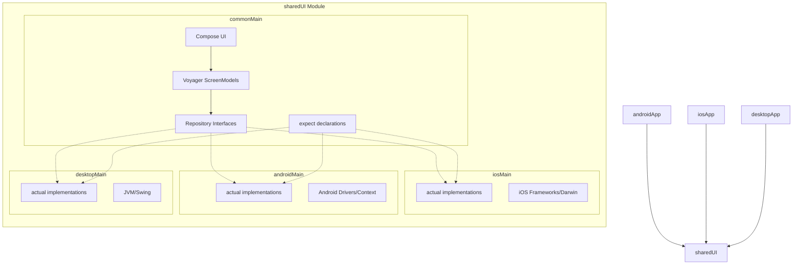

# Memory-Match

A professional Kotlin Multiplatform (KMP) memory game built with modern development practices, featuring shared UI and logic across Android, iOS, and Desktop.

## 🚀 Platform Matrix

| Platform          | Status | Support                               |
|:------------------|:-------|:--------------------------------------|
| **Android**       | Stable | Native via Jetpack Compose            |
| **iOS**           | Beta   | Compose Multiplatform / UIKit Interop |
| **Desktop (JVM)** | Stable | Compose for Desktop                   |

## ✨ Features

- **Multiple Game Modes**: Standard and Time Attack modes for varied gameplay.
- **Difficulty Levels**: Adjustable pair counts to suit all skill levels.
- **Rich UX**: Smooth animations (Confetti, Bouncing Cards), Audio feedback, and Haptics.
- **Persistence**: Local high scores and game state saved via Room KMP.
- **Interactive Tutorial**: Built-in walkthrough for new players.
- **Adaptive UI**: Responsive layouts for mobile and desktop screens.

## 🏗 Project Structure

The project follows a modular KMP architecture to maximize code sharing while maintaining platform flexibility.

```text
.
├── androidApp/          # Android-specific entry point and resources
├── iosApp/              # iOS-specific Xcode project and Swift entry point
├── desktopApp/          # Desktop-specific JVM entry point
├── sharedUI/            # Shared Compose Multiplatform UI and Business Logic
│   ├── commonMain/      # Core logic, UI, and data (99% of the code)
│   ├── androidMain/     # Android-specific implementations
│   ├── iosMain/         # iOS-specific implementations
│   └── desktopMain/     # Desktop-specific implementations
└── gradle/              # Dependency management via Version Catalogs
```

### Architecture Overview

The following diagram illustrates how `commonMain` interacts with platform-specific implementations using the `expect`/`actual` mechanism and Dependency Inversion.



## 🛠 Tech Stack (2026 Standard)

- **Language:** [Kotlin 2.3.0](https://kotlinlang.org/) (K2 Mode, Context Parameters).
- **UI Framework:** [Compose Multiplatform 1.10.0](https://www.jetbrains.com/lp/compose-multiplatform/) for shared UI.
- **Dependency Injection:** [Metro 0.9.4](https://github.com/ZacSweers/metro) for compile-time safe DI.
- **Networking:** [Ktor 3.3.3](https://ktor.io/) for multiplatform asynchronous HTTP requests.
- **Persistence:** [Room (KMP) 2.8.4](https://developer.android.com/kotlin/multiplatform/room) for local database storage.
- **Navigation:** [Voyager 1.1.0](https://voyager.adriel.cafe/) for multiplatform navigation and ScreenModel management.
- **Concurrency:** [Kotlin Coroutines 1.10.2](https://kotlinlang.org/docs/coroutines-overview.html) & [Flow](https://kotlinlang.org/docs/flow.html).
- **Image Loading:** [Coil3 3.3.0](https://coil-kt.github.io/coil/) for multiplatform image loading.
- **Logging:** [Kermit 2.0.8](https://github.com/touchlab/Kermit) for multiplatform logging.
- **Testing:** [Turbine 1.2.1](https://github.com/cashapp/turbine) and [Mokkery 3.1.1](https://github.com/lupu11/Mokkery).

## ⚙️ Setup & Installation

### Prerequisites

- **Android Studio Ladybug** (or newer) or **IntelliJ IDEA**.
- **Kotlin Multiplatform** plugin installed.
- **Xcode 15+** (for iOS development).
- **JDK 17+** installed and configured.

### Environment Check

Run the following command to ensure your environment is correctly configured:

```bash
./gradlew check
```

## 🏃 How to Run

### Android
Run the application from Android Studio by selecting the `androidApp` configuration or use the CLI:
```bash
./gradlew :androidApp:installDebug
```

### iOS
1. Open `iosApp/iosApp.xcodeproj` in Xcode.
2. Select a simulator or physical device.
3. Press **Run**.

Alternatively, use Fleet or the `sharedUI` module's iOS targets.

### Desktop
Run the desktop application using:
```bash
./gradlew :desktopApp:run
```

## 🤝 Contribution Guidelines

1. **Architecture:** Strictly follow Clean Architecture and SOLID principles.
2. **UI:** All UI should be built using Compose Multiplatform in `sharedUI/commonMain`.
3. **State Management:** Use Unidirectional Data Flow (UDF) with Voyager ScreenModels.
4. **Testing:** Ensure logic coverage in `commonTest` using Turbine and Mokkery.

Please read `AGENTS.md` for detailed architectural rules and coding standards.
