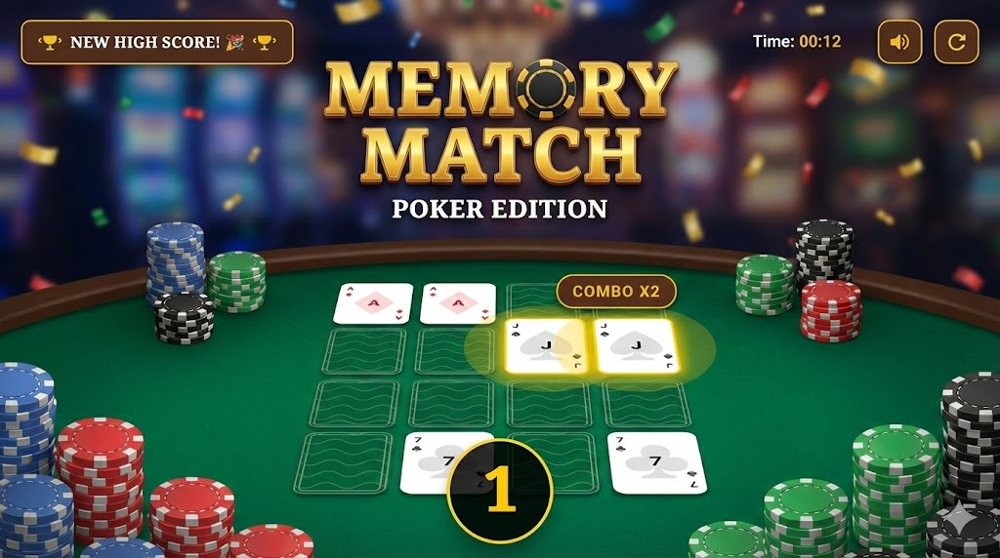
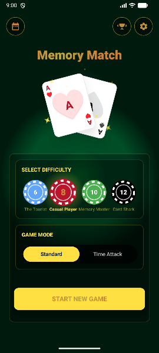
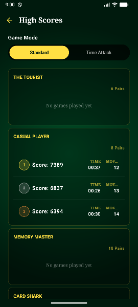
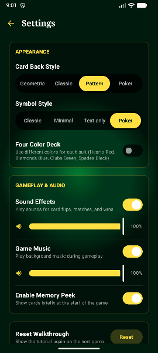
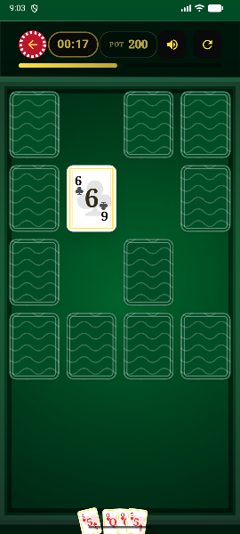
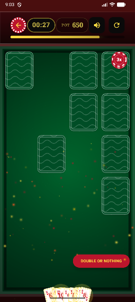
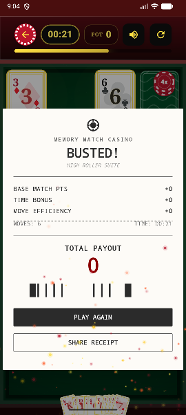
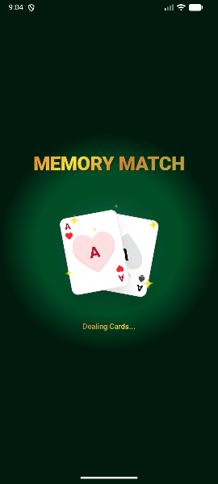
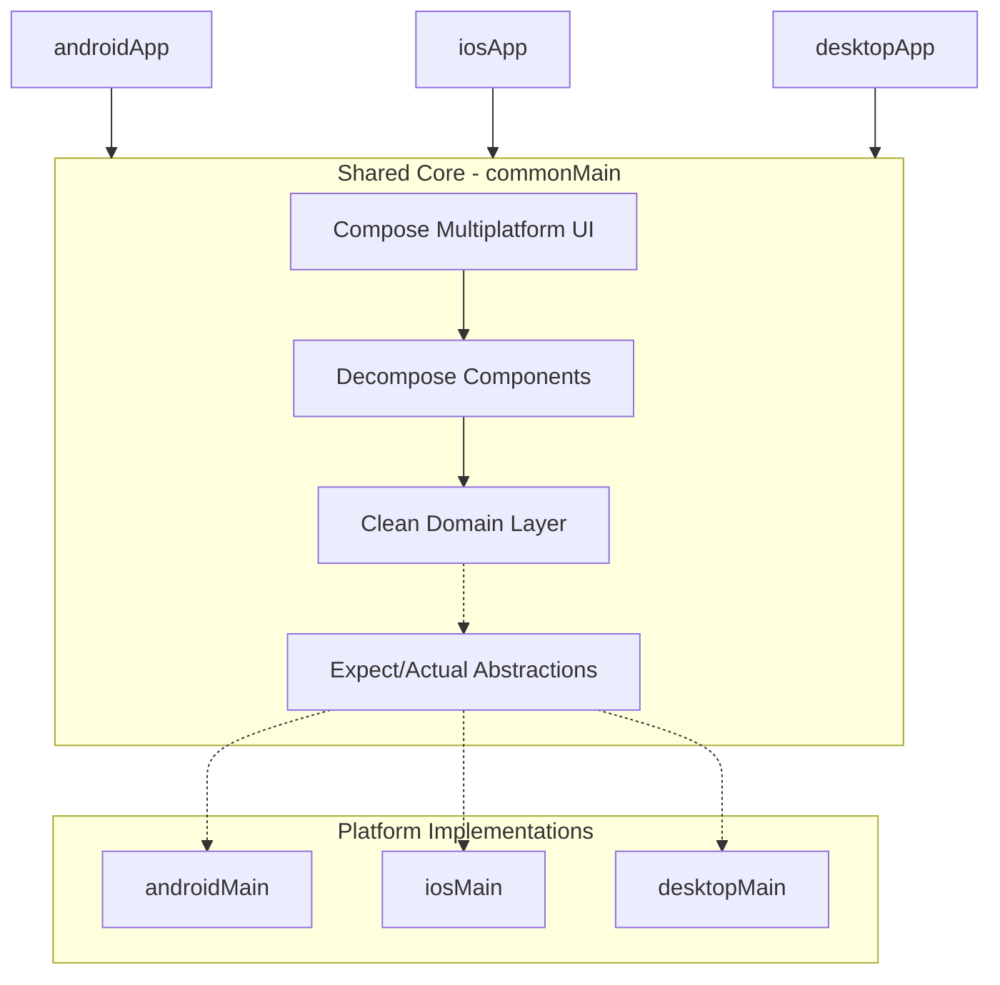

<p align="center">
  
</p>

# 🧩 Memory-Match

[](https://kotlinlang.org/)
[](https://www.jetbrains.com/lp/compose-multiplatform/)
[](https://opensource.org/licenses/MIT)

**A high-performance, cross-platform memory game built with Kotlin Multiplatform, showcasing modern 2026 development standards.**

Memory-Match is not just a game; it's a reference implementation for **Clean Architecture**, **Modular Design**, and **AI-Agentic Development** in the Kotlin ecosystem.

---

## 🚀 Platform Matrix

| Platform       | Tier   | Implementation                          | Stability |
| :------------- | :----- | :-------------------------------------- | :-------- |
| **Android**    | Tier 1 | Native via Jetpack Compose & Material 3 | Stable    |
| **iOS**        | Tier 1 | Compose Multiplatform (UIKit Interop)   | Beta      |
| **Desktop**    | Tier 2 | Compose for Desktop (JVM)               | Stable    |
| **Web (Wasm)** | Tier 3 | Compose for Web (Experimental)          | Planned   |

---

## 📸 Experience the UI

<p align="center">
  
  
  
  
</p>
<p align="center">
  
  
  
</p>

---

## 🎮 Gameplay & Features

Memory-Match goes beyond a simple card game by introducing high-stakes mechanics and a dynamic "Heat" system that rewards precision and speed.

### 🕹️ Game Modes
*   **Standard**: A relaxed experience focused on accuracy. No time limits, perfect for sharpening your memory at your own pace.
*   **Time Attack**: Race against the clock! Every match rewards you with extra seconds, while mismatches penalize your remaining time. How long can you survive?
*   **Daily Challenge**: A unique, fixed puzzle generated every 24 hours. Compete with others on the same board and see who can achieve the best score.

### 🔥 Combo-Driven "Heat" System
Success breeds intensity. By matching multiple pairs in quick succession, you build a **Combo Multiplier**.
*   **Activation**: Reach a `Combo x4` or higher to trigger **Heat Mode**.
*   **Visual Transformation**: The UI shifts to an electric neon color palette with smooth animated background transitions.
*   **Tactile Feedback**: Haptics become significantly more pronounced, making every match feel explosive.
*   **Rewards**: High combos in Time Attack grant massive "Mega Bonus" time gains, essential for high-score runs.
*   **All-In Double Down**: Activate specific "Doubling" mode to gamble your entire game.
    *   **The Risk**: Instant Game Over on any mismatch.
    *   **The Reward**: 2x Score Multiplier if you clear the board.
    *   **Constraint**: Requires 3+ pairs to activate.

### ✨ Key Features
*   **Interactive Walkthrough**: A seamless, step-by-step introduction for new players, ensuring they understand the "Heat" mechanics and game objectives from the very first flip.
*   **Game Results & Analytics**: Receive a comprehensive breakdown of your performance after every match, including accuracy percentages, match speed, and combo efficiency.
*   **Visual Polish & Dynamics**: Experience high-fidelity animations with the **Bouncing Cards Overlay**, dynamic **Confetti Celebrations**, and particle-based flip effects.
*   **Customizable Aesthetics**: Choose from diverse **Card Back Themes** (Geometric, Minimal, Tactical) and **Symbol Sets** (Classic, Modern, Abstract).
*   **Platform-Native Haptics**: Professional haptic feedback (iOS Taptic Engine / Android Vibrator) calibrated for specific game events, from card flips to "Heat" activation.
*   **State Persistence**: Your progress is automatically saved locally using **Room KMP**, allowing you to resume any game exactly where you left off.
*   **Deep-Linked Replays**: Share specific game configurations via deep links (`memorymatch://game?seed=...`). Every game generates a unique seed for sharing exact card layouts.
*   **Comprehensive Stats**: Track your best scores, fastest times, and total moves across all difficulty levels and game modes.

---

## 🏗 Modular Architecture

The project follows a **Local-First, Modular-Core** strategy within the `sharedUI` module, ensuring that 95% of business logic and UI remains shared while maintaining platform-specific performance.



### 🧠 Modern 2026 Idioms
- **Context Parameters**: Leveraging `-Xcontext-parameters` for clean, boilerplate-free dependency injection in functions.
- **Strong Skipping**: Optimized for Compose Multiplatform performance using `kotlinx.collections.immutable`.
- **K2 Compiler Flow**: Fully optimized for the K2 compiler, ensuring sub-second incremental build times.
- **AI-Native**: Designed to be navigated and extended by both humans and AI agents (see `AGENTS.md`).

---

## 🏛 Architecture (MVVM)

We use a **Component-Based MVVM** pattern powered by **Decompose**, ensuring strict state management and lifecycle awareness across all platforms.

| Role          | Responsibility             | Implementation                               |
| :------------ | :------------------------- | :------------------------------------------- |
| **Model**     | Business Logic & Data      | Domain Models, UseCases, Repositories        |
| **View**      | UI Representation          | Compose Multiplatform (`@Composable`)        |
| **ViewModel** | State & Logic Orchestrator | Decompose Components (e.g., `GameComponent`) |

### 🔄 Unidirectional Data Flow (UDF)

1.  **State Exposure**: Components expose a single, immutable `StateFlow<UIState>` (e.g., `GameUIState`) that the UI observes.
2.  **User Intent**: The UI communicates user actions (e.g., `onFlipCard`) by calling methods directly on the Component.
3.  **Side Effects**: One-time ephemeral events (e.g., playing a sound, vibrating, or navigating) are broadcast via a `Flow` or `Channel` to be collected by the UI or platform layer.
4.  **Lifecycle Safety**: Components are tied to the Decompose lifecycle, ensuring state is preserved during configuration changes but cleared when the screen is destroyed.

---

## 🛠 Tech Stack (2026 Standard)

| Layer             | Technology                | Version     | Key Benefit                                         |
| :---------------- | :------------------------ | :---------- | :-------------------------------------------------- |
| **Language**      | **Kotlin**                | 2.3.0       | K2 Mode, Context Parameters, Multi-dollar strings   |
| **UI**            | **Compose Multiplatform** | 1.10.0      | Adaptive layouts, Shared Resources, Skiko Rendering |
| **Collections**   | **Immutable Collections** | 0.5.0       | Optimized Strong Skipping support for Compose       |
| **DI**            | **Koin**                  | 4.0.2       | Pragmatic, stable, KMP-native                       |
| **Navigation**    | **Decompose**             | 3.4.0       | Lifecycle-aware, platform-agnostic navigation       |
| **Persistence**   | **Room (KMP)**            | 2.8.4       | Type-safe SQLite, Bundled Drivers                   |
| **Networking**    | **Ktor**                  | 3.x         | Multi-platform asynchronous client                  |
| **Image Loading** | **Coil3**                 | 3.x         | Multiplatform-first image pipeline                  |
| Testing           | **Turbine + Mokkery**     | 1.2.1 / 3.x | Flow-first testing, KSP-based mocking               |

---

## 🛠 Built With

Memory-Match is developed using modern AI-first tooling and professional IDEs:
- **Google Antigravity**: For advanced agentic coding and architectural orchestration.
- **Android Studio**: The primary development environment for Kotlin Multiplatform.
- **Gemini**: Powering AI-assisted development, brainstorming, and code generation.
- **Google AI Studio**: For rapid prototyping and testing of generative AI models.
- **Warp Terminal**: The intelligent terminal for modern development workflows.


---

## 🧪 Testing Strategy

Quality is baked into the foundation. We use a multi-layered testing approach to ensure stability across platforms.

### 🛠 Test Suite
- **Shared Domain & Data**: Logic is tested in `commonTest` using **Mokkery** for mocking and **Turbine** for asynchronous Flow validation.
- **Component Tests**: Decompose components are tested in isolation, validating state transitions and side effects.
- **Platform Unit Tests**: Specific implementations (e.g., Room migrations, Android-specific logic) have dedicated tests in their respective modules.

### 🚀 Running Tests
You can run all tests across the entire project with a single command:
```bash
./run_tests.sh
```

Alternatively, run specific module tests:
- **Shared Module**: `./gradlew :sharedUI:allTests`
- **Android App**: `./gradlew :androidApp:testDebugUnitTest`
- **Desktop App**: `./gradlew :desktopApp:test`

---

## 🔍 Static Analysis (Detekt)

We use **Detekt** to maintain high code quality and enforce Kotlin-specific best practices across all KMP modules. Detekt helps identify code smells, potential bugs, and complexity issues early in the development cycle.

### 🚀 Usage Commands

| Command                           | Description                                                       |
| :-------------------------------- | :---------------------------------------------------------------- |
| `./gradlew detekt`                | Runs analysis on all source sets and generates reports.           |
| `./gradlew detekt --auto-correct` | Automatically fixes minor linting and formatting issues.          |
| `./gradlew detektBaseline`        | Generates or updates the baseline file to ignore existing issues. |
| `./gradlew detektMain`            | Runs analysis specifically on the main source sets.               |

### 📊 Configuration & Reports
- **Config File**: Located at `config/detekt/detekt.yml`. This file defines the rules and severity levels.
- **Reports**: Generated in `build/reports/detekt/` in HTML, XML, SARIF, and Markdown formats.
- **Baselines**: Issues recorded in `config/detekt/baseline.xml` are suppressed, allowing you to focus on new technical debt.

---

## 📊 Code Coverage (Kover)

We use **Kotlinx Kover** to measure and enforce test coverage across our KMP modules. Our current goal is to maintain a minimum of **80% line coverage** for all business logic in the domain and data layers.

### 📈 Current Status
- **Overall Line Coverage**: **90.9%** (Exceeding the 80% target) ✅
- **Domain Layer Coverage**: **100%** 🎯

### 🚀 Usage Commands

| Command                     | Description                                                  |
| :-------------------------- | :----------------------------------------------------------- |
| `./gradlew koverHtmlReport` | Generates a comprehensive HTML coverage report.              |
| `./gradlew koverVerify`     | Verifies that the code coverage meets the defined threshold. |
| `./gradlew koverXmlReport`  | Generates an XML report (useful for CI/CD integration).      |

### 📚 Detailed Documentation
For more information on our coverage strategy, metrics, and best practices, please refer to:
- **[KOVER_COVERAGE_SUMMARY.md](docs/KOVER_COVERAGE_SUMMARY.md)**: A high-level overview of our recent coverage improvements.
- **[KOVER_COVERAGE_RESEARCH.md](docs/KOVER_COVERAGE_RESEARCH.md)**: In-depth research on KMP coverage, Kover limitations, and our 80%+ strategy.

---

## 🤖 AI-Agentic Development

This repository is **Agent-Ready**, designed to be seamlessly navigated and extended by AI coding assistants.

- **[AGENTS.md](AGENTS.md)**: Serves as the **Immutable Source of Truth** for the project. It outlines the architectural foundation, 2026 coding idioms (like Context Parameters), and platform-specific constraints that agents must follow.
- **[.Agent/rules](.Agent/rules)**: Contains granular, context-specific instructions and linting rules. These rules ensure that AI-generated code adheres to the project's strict standards for Compose Multiplatform, Decompose, and Clean Architecture.

If you are using an AI coding assistant (like Cursor, Windsurf, or Antigravity), ensure it indexes these files to maintain high-quality, idiomatic contributions.

---

## ⚙️ Setup & Developer Experience (DX)

### Prerequisites
- **Android Studio Ladybug** or **IntelliJ IDEA 2024.3+**
- **JDK 21** (Azul Zulu recommended)
- **Xcode 15.0+** (for iOS builds)

### Quick Start
```bash
# Clone the repository
git clone https://github.com/smithjustinn/Memory-Match.git

# Validate environment
./gradlew check

# Run the Android app
./gradlew :androidApp:installDebug

# Run the Desktop app
./gradlew :desktopApp:run
```

---

## 🤝 Contribution Guidelines

We adhere to the **Kotlin 2.3+ Clean Architecture** guidelines.
1. **Consistency**: Check `AGENTS.md` for the latest coding standards.
2. **UI First**: All UI components must reside in `sharedUI/commonMain` unless platform-specific interop (e.g., Apple HealthKit) is required.
3. **State Management**: Maintain Unidirectional Data Flow using Decompose Components.
4. **Commits**: Follow [Conventional Commits](https://www.conventionalcommits.org/).

---
*Developed with ❤️ and Kotlin Multiplatform.*