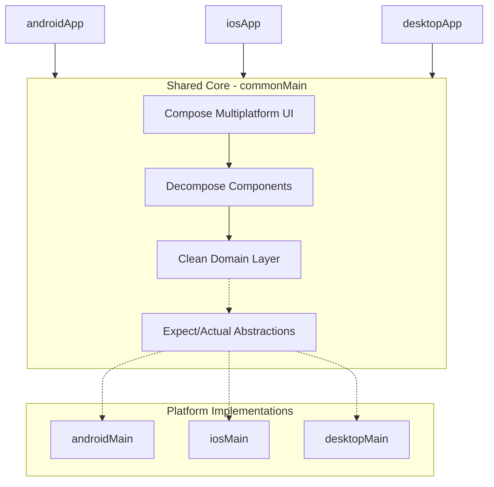

<p align="center">
  
</p>

# 🧩 Memory-Match

[](https://kotlinlang.org/)
[](https://www.jetbrains.com/lp/compose-multiplatform/)
[](https://opensource.org/licenses/MIT)

**A high-performance, cross-platform memory game built with Kotlin Multiplatform, showcasing modern 2026 development standards.**

Memory-Match is not just a game; it's a reference implementation for **Clean Architecture**, **Modular Design**, and **AI-Agentic Development** in the Kotlin ecosystem.

---

## 🚀 Platform Matrix

| Platform       | Tier   | Implementation                          | Stability |
| :------------- | :----- | :-------------------------------------- | :-------- |
| **Android**    | Tier 1 | Native via Jetpack Compose & Material 3 | Stable    |
| **iOS**        | Tier 1 | Compose Multiplatform (UIKit Interop)   | Beta      |
| **Desktop**    | Tier 2 | Compose for Desktop (JVM)               | Stable    |
| **Web (Wasm)** | Tier 3 | Compose for Web (Experimental)          | Planned   |

---

## 📸 Experience the UI

<p align="center">
  
  
  
</p>
<p align="center">
  
  
  
</p>

---

## 🏗 Modular Architecture

The project follows a **Local-First, Modular-Core** strategy within the `sharedUI` module, ensuring that 95% of business logic and UI remains shared while maintaining platform-specific performance.



### 🧠 Modern 2026 Idioms
- **Context Parameters**: Leveraging `-Xcontext-parameters` for clean, boilerplate-free dependency injection in functions.
- **K2 Compiler Flow**: Fully optimized for the K2 compiler, ensuring sub-second incremental build times.
- **AI-Native**: Designed to be navigated and extended by both humans and AI agents (see `AGENTS.md`).

---

## 🏛 Architecture (MVVM)

We use a **Component-Based MVVM** pattern powered by **Decompose**, ensuring strict state management and lifecycle awareness across all platforms.

| Role          | Responsibility             | Implementation                               |
| :------------ | :------------------------- | :------------------------------------------- |
| **Model**     | Business Logic & Data      | Domain Models, UseCases, Repositories        |
| **View**      | UI Representation          | Compose Multiplatform (`@Composable`)        |
| **ViewModel** | State & Logic Orchestrator | Decompose Components (e.g., `GameComponent`) |

### 🔄 Unidirectional Data Flow (UDF)

1.  **State Exposure**: Components expose a single, immutable `StateFlow<UIState>` (e.g., `GameUIState`) that the UI observes.
2.  **User Intent**: The UI communicates user actions (e.g., `onFlipCard`) by calling methods directly on the Component.
3.  **Side Effects**: One-time ephemeral events (e.g., playing a sound, vibrating, or navigating) are broadcast via a `Flow` or `Channel` to be collected by the UI or platform layer.
4.  **Lifecycle Safety**: Components are tied to the Decompose lifecycle, ensuring state is preserved during configuration changes but cleared when the screen is destroyed.

---

## 🛠 Tech Stack (2026 Standard)

| Layer             | Technology                | Version       | Key Benefit                                         |
| :---------------- | :------------------------ | :------------ | :-------------------------------------------------- |
| **Language**      | **Kotlin**                | 2.3.0         | K2 Mode, Context Parameters, Multi-dollar strings   |
| **UI**            | **Compose Multiplatform** | 1.10.0        | Adaptive layouts, Shared Resources, Skiko Rendering |
| **DI**            | **Metro**                 | 0.9.4         | Compile-time safe, Zero-reflection, KMP-native      |
| **Navigation**    | **Decompose**             | 3.4.0         | Lifecycle-aware, platform-agnostic navigation       |
| **Persistence**   | **Room (KMP)**            | 2.8.4         | Type-safe SQLite, Bundled Drivers                   |
| **Networking**    | **Ktor**                  | 3.3.3         | CIO Engine, Type-safe Content Negotiation           |
| **Image Loading** | **Coil3**                 | 3.3.0         | Multiplatform-first image pipeline                  |
| **Testing**       | **Turbine + Mokkery**     | 1.2.1 / 3.1.1 | Flow-first testing, KSP-based mocking               |

---

## 🤖 AI-Agentic Development

This repository is **Agent-Ready**. If you are using an AI coding assistant (like Cursor, Windsurf, or Copilot), please point it to the `AGENTS.md` file. It contains the **Immutable Source of Truth** for architectural rules, 2026 coding idioms, and platform-specific constraints.

---

## ⚙️ Setup & Developer Experience (DX)

### Prerequisites
- **Android Studio Ladybug** or **IntelliJ IDEA 2024.3+**
- **JDK 21** (Azul Zulu recommended)
- **Xcode 15.0+** (for iOS builds)

### Quick Start
```bash
# Clone the repository
git clone https://github.com/smithjustinn/Memory-Match.git

# Validate environment
./gradlew check

# Run the Android app
./gradlew :androidApp:installDebug

# Run the Desktop app
./gradlew :desktopApp:run
```

---

## 🤝 Contribution Guidelines

We adhere to the **Kotlin 2.3+ Clean Architecture** guidelines.
1. **Consistency**: Check `AGENTS.md` for the latest coding standards.
2. **UI First**: All UI components must reside in `sharedUI/commonMain` unless platform-specific interop (e.g., Apple HealthKit) is required.
3. **State Management**: Maintain Unidirectional Data Flow using Decompose Components.
4. **Commits**: Follow [Conventional Commits](https://www.conventionalcommits.org/).

---
*Developed with ❤️ and Kotlin Multiplatform.*
