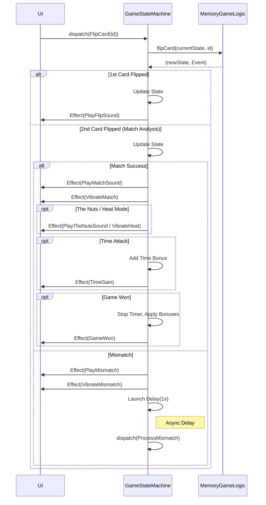
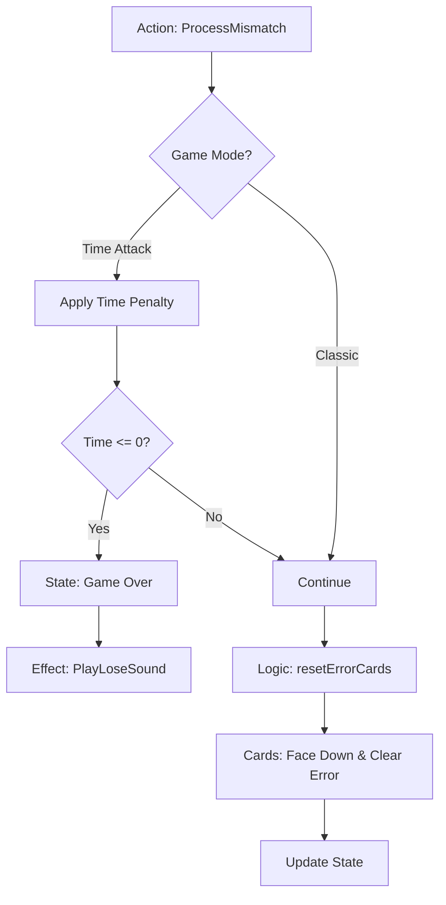

# Card Game Engine Documentation

This document maps out the architecture, flow, and states of the Memory Match game engine.

## 1. Overview

The game engine is built on a **unidirectional data flow** architecture, often referred to as MVI (Model-View-Intent) or Redux-like.

*   **State**: Single source of truth, immutable.
*   **Actions**: Inputs/Intents that trigger state changes.
*   **Effects**: One-off side effects (sounds, vibration, navigation) emitted to the UI.
*   **Logic**: Pure functions that calculate the next state.

### Key Components

| Component              | Role                                                              | Location                                    |
| :--------------------- | :---------------------------------------------------------------- | :------------------------------------------ |
| **`GameStateMachine`** | Orchestrator. Manages `StateFlow` and emits `SharedFlow` effects. | `shared/core/.../GameStateMachine.kt`       |
| **`MemoryGameState`**  | Immutable data model representing the game state.                 | `shared/core/.../models/MemoryGameState.kt` |
| **`MemoryGameLogic`**  | Pure business logic (rules, scoring, state transitions).          | `shared/core/.../MemoryGameLogic.kt`        |
| **`GameAction`**       | Sealed class representing inputs (e.g., `FlipCard`, `Tick`).      | `shared/core/.../GameStateMachine.kt`       |
| **`GameEffect`**       | Sealed class representing outputs (e.g., `PlaySound`).            | `shared/core/.../GameStateMachine.kt`       |

---

## 2. Game State (`MemoryGameState`)

The `MemoryGameState` is an immutable data class. Key properties include:

*   **`cards`**: List of `CardState` (Face Up, Matched, Error, etc.).
*   **`mode`**: `TIME_ATTACK` or `CLASSIC`.
*   **`score`**: Current score.
*   **`comboMultiplier`**: Multiplier for consecutive matches (Heat Mode).
*   **`isDoubleDownActive`**: Flag for the high-risk/high-reward mode.
*   **`isGameOver` / `isGameWon`**: End-game flags.
*   **`config`**: `ScoringConfig` (points per match, penalties, etc.).

---

## 3. Game Flows

### 3.1 Card Flip Flow

This is the core interaction loop.



### 3.2 Process Mismatch Flow

Handles the cleanup after a failed match attempt.



### 3.3 Double Down Flow

A risk/reward mechanic where the player can double their points but risks instant loss on mismatch.

```mermaid
graph TD
    UI[UI: Double Down Button] -->|Action: DoubleDown| GSM[GameStateMachine]
    GSM -->|Logic: activateDoubleDown| Check{Eligible?}
    
    Check -- Yes --> Active[State: isDoubleDownActive = true]
    Active --> Effect[Effect: VibrateHeat]
    Effect --> Scan[Action: ScanCards]
    
    Scan --> Reveal[Briefly Reveal All Cards]
    Reveal --> Hide[Hide Cards]
    
    Check -- No --> Ignore[No Change]

    subgraph "During Double Down"
        Match[Match] -->|Success| Keep[Keep Active / Score++]
        Mismatch[Mismatch] -->|Failure| GameOver[BUSTED: Game Over (Score 0)]
    end
```

---

## 4. State Machine Implementation Details

The `GameStateMachine` uses a `Mutex` to ensure interactions are thread-safe and processed sequentially where necessary.

### Concurrency
*   **`GameTimer`**: Runs on a separate coroutine, dispatching `Tick` actions.
*   **`ScanCards`**: Spawns a coroutine to reveal cards, wait, and hide them.
*   **`ProcessMismatch`**: Uses `delay()` ensuring the user sees the mismatch (red cards) before they flip back.

### Effects System
Effects are emitted via a `SharedFlow` (`_effects`). This ensures:
1.  **One-off**: Effects are not re-played on configuration changes.
2.  **Decoupling**: The State Machine handles *logic*, the UI handles *presentation* (audio, haptics).

## 5. Event Dictionary

Mapping of internal Domain Events to resulting Side Effects.

| Domain Event      | Resulting Effects                                             |
| :---------------- | :------------------------------------------------------------ |
| `CardFlipped`     | `PlayFlipSound`                                               |
| `MatchSuccess`    | `PlayMatchSound`, `VibrateMatch`, `TimerUpdate` (Time Attack) |
| `TheNutsAchieved` | `PlayTheNutsSound`, `VibrateMatch`, `TimerUpdate`             |
| `MatchFailure`    | `PlayMismatch`, `VibrateMismatch`                             |
| `GameWon`         | `PlayWinSound`, `VibrateMatch`, `GameWon`                     |
| `GameOver`        | `PlayLoseSound`, `GameOver`                                   |
